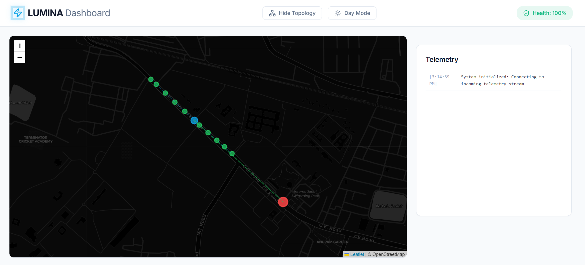
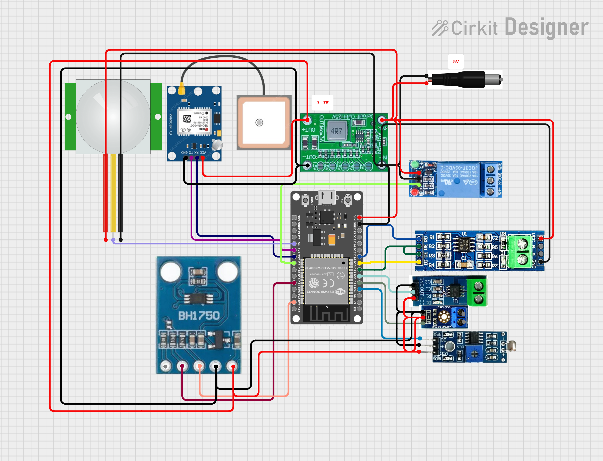
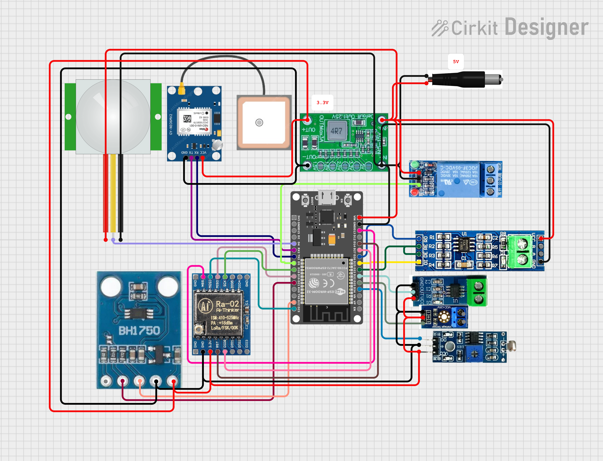
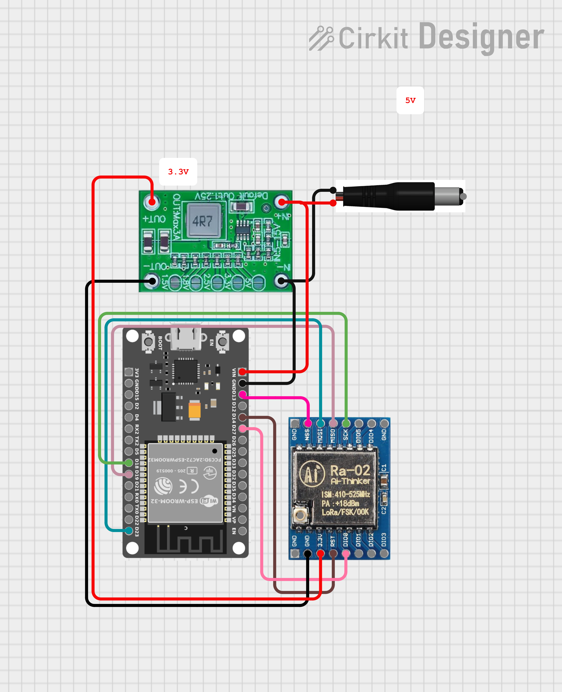

# Lumina — Smart Street Light Monitoring System

A distributed IoT platform for autonomous street light management, real-time fault detection, and centralized monitoring across urban infrastructure.

Built on ESP32, the system employs a layered communication architecture — RS485 for local mesh coordination, LoRa (SX1278) for long-range backhaul, and a Django/React dashboard for operational visibility.

---

## Architecture Overview

```
Local Nodes (A1, A2, ...)
         │ RS485
    Master Node (B)
         │ LoRa
   LoRa Gateway (ESP32)
         │ USB / Serial
      Host Machine
         │ HTTP
  Django + React Dashboard
```

The system operates in three tiers. **Local nodes** handle sensor acquisition and relay control. The **master node** aggregates local data, reads its own sensors, and transmits upstream via LoRa. The **gateway** bridges LoRa to the host machine, which runs the monitoring backend.

---

## Key Capabilities

**Autonomous Operation** — Nodes activate only at night, determined by ambient light via LDR, and trigger illumination on motion detection via PIR sensor. No manual scheduling required.

**Fault Detection** — Continuous voltage and current monitoring enables detection of lamp failures, wiring anomalies, and load deviations before they escalate.

**Hybrid Communication** — RS485 provides reliable multi-drop local communication. LoRa extends coverage to distances impractical for wired alternatives, with no cellular dependency.

**GPS Positioning** — Each node reports its geographic coordinates via Neo-6M, enabling precise fault localization on the dashboard map.

**Scalable Topology** — Additional local nodes can be added to any RS485 segment without changes to the master or gateway firmware.

---

## Node Reference

### Local Node (Type A)

Responsible for sensor acquisition, relay control, and data forwarding to the master node via RS485.

#### Pin Configuration

| Interface | Signal | GPIO |
|-----------|--------|------|
| UART — GPS | RX (from GPS TX) | 16 |
| UART — GPS | TX (to GPS RX) | 17 |
| RS485 | RO (Receive) | 26 |
| RS485 | DI (Transmit) | 25 |
| RS485 | RE / DE | 33 |
| I²C — BH1750 | SDA | 21 |
| I²C — BH1750 | SCL | 22 |
| Sensors | PIR | 4 |
| Sensors | Current | 32 |
| Sensors | LDR | 34 |
| Sensors | Voltage | 35 |
| Output | Relay | 5 |

---

### Master Node (Type B)

Aggregates data from all local nodes, reads its own sensor suite, and transmits via LoRa. Shares the same sensor and RS485 configuration as Type A, with the addition of a LoRa radio.

#### Additional Pins — LoRa SX1278

| Signal | GPIO |
|--------|------|
| MISO | 19 |
| MOSI | 23 |
| SCK | 18 |
| NSS (CS) | 13 |
| RST | 14 |
| DIO0 | 27 |

---

### LoRa Gateway

Receives LoRa packets from the master node and forwards them to the host machine over USB serial. Uses the same SX1278 pin mapping as the master node.

---

## Hardware Notes

**GPIO constraints** — Avoid GPIOs 0, 2, 12, and 15 for peripheral assignment; these are strapping pins with boot-time implications. GPIOs 34, 35, 36, and 39 are input-only.

**Relay on GPIO 5** — GPIO 5 is a strapping pin sampled at boot. Use a 10 kΩ pull-up resistor to 3.3 V to hold it HIGH during the boot sequence, preventing inadvertent relay activation. The ESP32 can still drive it LOW at runtime; the weak pull-up offers no meaningful resistance to the output driver.

**RS485 termination** — Place a 120 Ω resistor across the A/B lines at each physical end of the bus. Omitting termination causes reflections on longer cable runs.

**Relay driver** — Use a relay module with an onboard transistor driver and flyback diode. Driving an inductive load directly from an ESP32 GPIO will cause voltage spikes and eventual GPIO damage.

**Common ground** — All modules — ESP32, RS485 transceiver, LoRa module, sensors — must share a common GND reference. Floating grounds are a frequent source of communication errors.

**LoRa antenna** — Never power the SX1278 without an antenna connected. Operating without a load will damage the RF front end.

---

## Dashboard

The monitoring interface is built with Django (backend) and React (frontend). It provides:

- Live sensor readings per node (voltage, current, light level, motion state)
- Fault alerts with node identification and GPS coordinates
- Historical data visualization and trend analysis



---

## Circuit Diagram





---

## Setup

1. Flash firmware to each ESP32 node (local, master, gateway)
2. Wire RS485 bus between local nodes and the master node; terminate both ends
3. Verify LoRa link between master node and gateway
4. Connect gateway to host machine via USB
5. Start Django backend and apply migrations
6. Start React frontend
7. Confirm nodes appear and report data in the dashboard

---

## Future Enhancements

- MQTT integration for cloud-native deployments
- Adaptive PWM brightness control based on ambient conditions and traffic
- ML-based anomaly detection for predictive maintenance

---

## Applications

Urban street light networks, industrial site perimeter lighting, highway infrastructure monitoring, and any distributed outdoor lighting system requiring fault visibility without manual inspection.
